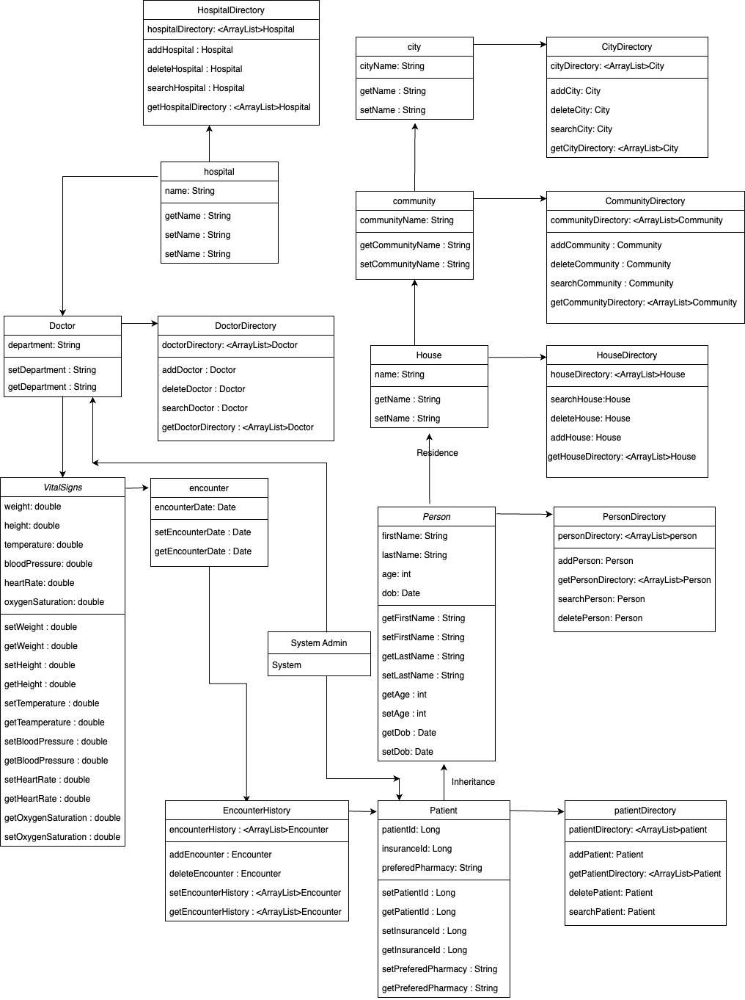

# Vohra_Aziz_002743485_assignment2
 
Requirement 
• Implement an application based on the given model with Java swing.  
o Patients are able to look for a doctor under the near hospitals 
o Doctors are able to diagnose and leave encounter record based on vital signs 
o Community admins are able to modify the information under a community 
o System admin should have all access(CRUD) to all resources in this application 
• You’re free to have extension design based on the given model, but you’re not allowed 
to delete any element in the model. 
• Your application is required to manage user data(CRUD). 
FYI:https://www.codecademy.com/articles/what-is-crud 
• UI&UX will be considered as a part of grade. 
• Data validation(Non-null check, basic data type check) 
• Design different roles of users in this application:(System administrator, patient, 
hospital administrator, community administrator, etc)  
• Draw a class diagram and sequence diagram and write the description of your project. 
Put them in your README file.

